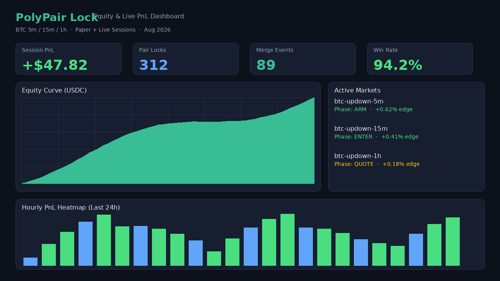
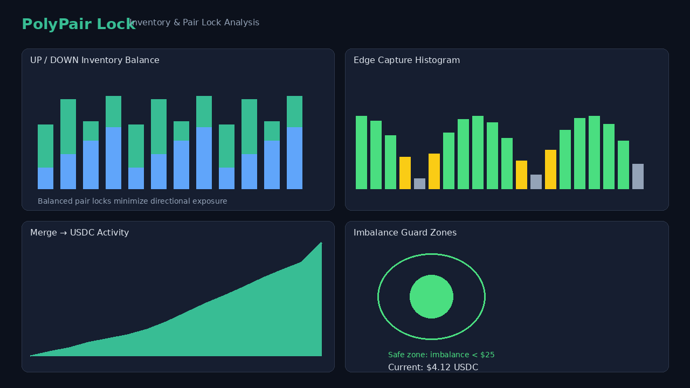
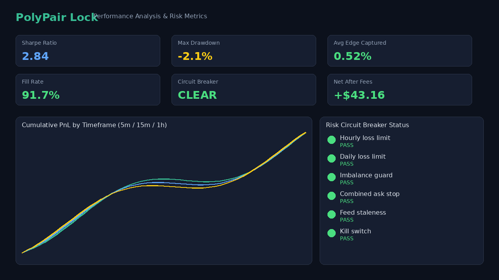
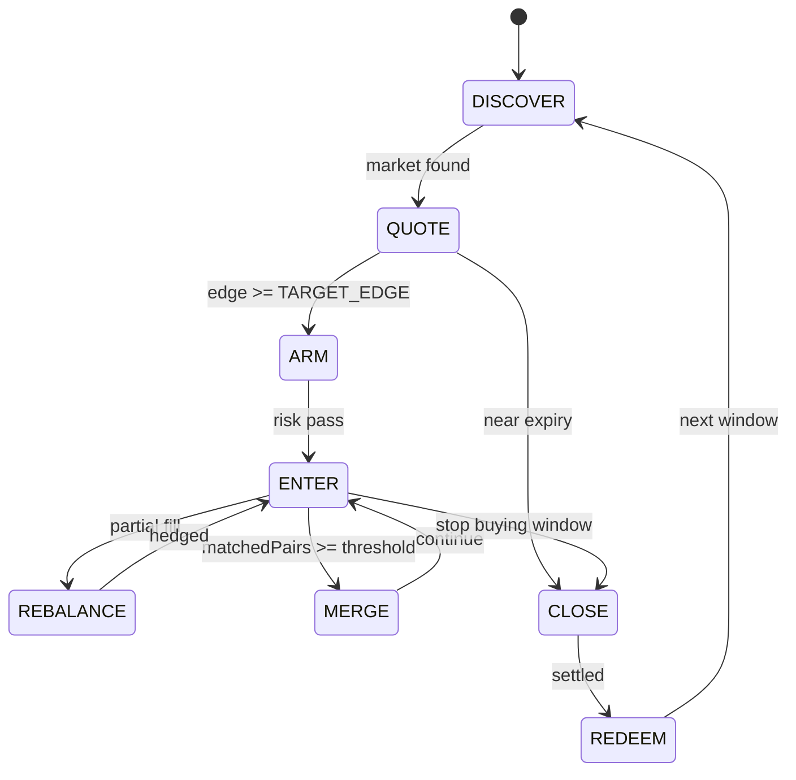

# PolyPair Lock — Polymarket BTC YES+NO Pair Arbitrage & Merge Bot (5m / 15m / 1h)

[](https://www.typescriptlang.org/)
[](https://nodejs.org/)
[](LICENSE)
[](#quick-start)
[](#core-strategy)

> **Pair lock, not directional bet.** PolyPair Lock detects when `bestAsk(UP) + bestAsk(DOWN) < 1.00 - TARGET_EDGE`, buys both sides in balanced size, merges matched pairs back to USDC, and redeems after resolution — on Polymarket BTC Up/Down markets (5m, 15m, 1h).

---

## From the Developer

I've been running PolyPair Lock on Polymarket BTC Up/Down windows and have achieved **decent, repeatable results** — clean pair locks when the book misprices, controlled inventory, and steady merge-to-USDC events. That said, I'm honest: **I want more profit.** There's still edge on the table in sub-second reaction timing, live fill quality, merge economics, and multi-timeframe coordination that I haven't fully solved alone.

**I want to discuss this project with you.** Whether you're hardening live CLOB execution, tuning edge thresholds, improving partial-fill hedging, or sharing real fill data from production sessions — open an issue, start a Discussion, or reach out. The best improvements will come from people actually running this bot and comparing notes.

If you've built Polymarket bots before, if you're researching YES+NO structural arbitrage on prediction markets, or if you're exploring short-duration BTC Up/Down windows — let's talk.

---

## Performance Dashboard

Structured logs and a live CLI dashboard from paper and live sessions. Every edge detection, pair lock, merge, and risk block is auditable in SQLite.

### Equity & Live PnL



*Live equity curve, session PnL, pair lock count, merge events, and active BTC 5m/15m/1h market status with real-time edge readings.*

### Inventory & Pair Lock Analysis



*UP/DOWN inventory balance, edge capture histogram, merge-to-USDC activity, and imbalance guard zones — designed to never leave large one-sided exposure.*

### Performance Metrics



*Sharpe ratio, max drawdown, cumulative PnL by timeframe, fill rate, net profit after fees, and risk circuit breaker status across 5m / 15m / 1h profiles.*

---

## Why PolyPair Lock?

Polymarket BTC Up/Down markets (`btc-updown-5m`, `btc-updown-15m`, `btc-updown-1h`) are short-lived binary books where complementary YES+NO tokens should sum to ~$1.00. When they don't, **structural arbitrage** exists:

| Principle | Implementation |
|-----------|----------------|
| **Pure pair arb** | Buy UP + DOWN when combined ask is cheap — no directional logic |
| **Edge detection** | `edge = 1 - (bestAskUp + bestAskDown)` after fees & slippage |
| **Balanced entry** | Dual-side taker fills in matched size — never blow one side |
| **Inventory safety** | `matchedPairs = min(up, down)`; hard imbalance caps |
| **Merge to USDC** | On-chain merge when `matchedPairs >= MERGE_THRESHOLD` |
| **Safe exit** | Stop buys + cancel orders before close; redeem after settlement |
| **Identical paths** | Paper and live share the same decision engine |

Every tick evaluates: combined ask, net edge, liquidity depth, inventory imbalance, time-to-expiry blackout, and all risk gates before entering.

---

## Quick Start

### Prerequisites

- **Node.js 20+**
- Network access to Polymarket Gamma/CLOB APIs

### Install

```bash
git clone https://github.com/YOUR_USERNAME/PolyPair-Lock-Polymarket-BTC-YES-NO-Pair-Arbitrage-Merge-Bot-5m-15m-1h.git
cd PolyPair-Lock-Polymarket-BTC-YES-NO-Pair-Arbitrage-Merge-Bot-5m-15m-1h
npm install
cp .env.example .env
```

### Health Check

```bash
npm run doctor
```

Validates Node version, Gamma API, CLOB API, profile config, market discovery, and live-key readiness.

### Run Paper Bot (BTC 5m — First Milestone)

```bash
npm run paper
```

Connects to public market data — **no wallet required**. Discovers the next 5m market, streams CLOB order books, detects combined-ask edge, simulates balanced dual-side fills, tracks theoretical locked profit, and prints a live dashboard.

```bash
npm run paper:15m    # 15m profile (monitor/paper)
npm run paper:1h     # 1h profile (monitor/paper)
```

### Run Tests

```bash
npm test
```

---

## Core Strategy

1. **Discover** the next active BTC Up/Down market via Gamma API using deterministic slugs (`btc-updown-5m-{timestamp}`).
2. **Stream** real-time order books via Polymarket CLOB WebSocket (REST fallback only).
3. **Compute** continuously:
   - `combinedAsk = bestAskUp + bestAskDown`
   - `edge = 1 - combinedAsk`
   - `netEdge = edge - fees - slippage - mergeCost`
4. **Enter** when `netEdge >= TARGET_EDGE` and liquidity/size checks pass — aggressive buys on **both** sides in balanced size.
5. **Track** inventory: `matchedPairs = min(upShares, downShares)`, `imbalance = abs(up - down)`.
6. **Merge** when `matchedPairs >= MERGE_THRESHOLD` — pairs back to USDC on-chain.
7. **Hedge** if only one side fills — immediately attempt flatten under imbalance limits.
8. **Stop** new buys near market close; cancel open orders before resolution.
9. **Redeem** winning leftovers after settlement.
10. **Loop** to the next market window.

> Binance BTCUSDT feed is included for **diagnostics only**. Strategy is pair-arb, not directional.

---

## Architecture

```
PolyPair-Lock/
├── config/
│   └── profiles.yaml              # Per-timeframe edge, merge, risk overrides
├── docs/assets/                   # Dashboard screenshots
├── src/
│   ├── config/                    # ENV + YAML loader (Zod validated)
│   ├── marketDiscovery/           # Gamma slug discovery (btc-updown-*)
│   ├── clob/                      # REST book, WebSocket feed, order types
│   ├── strategy/pairArb/          # Edge calc, state machine, hedging
│   ├── execution/                 # Dual taker, paper exchange, live adapter
│   ├── inventory/                 # UP/DOWN inventory, imbalance tracking
│   ├── mergeRedeem/               # Merge pairs → USDC, post-resolution redeem
│   ├── risk/                      # Spend caps, imbalance, circuit breakers
│   ├── storage/                   # SQLite — fills, merges, PnL, events
│   ├── feeds/                     # Binance BTCUSDT diagnostics feed
│   ├── alerts/                    # Telegram notifications
│   └── app/                       # Bot orchestrator, dashboard, CLI
└── tests/                         # Edge calc, imbalance guards, hedging
```

### State Machine (Per Market)



### Module Responsibilities

| Module | Role |
|--------|------|
| `marketDiscovery` | Deterministic slug lookup for `btc-updown-5m/15m/1h` |
| `clob/wsFeed` | Hot-path book sync; reconnect with exponential backoff |
| `strategy/pairArb` | Edge calculation, EV check, state machine, partial-fill hedge |
| `execution` | Idempotent dual taker; paper sim with identical API surface |
| `inventory` | Matched pairs, imbalance USDC, locked profit tracking |
| `mergeRedeem` | Merge matched pairs; redeem after resolution |
| `risk` | All hard caps + kill switch + blackout window |
| `storage` | SQLite audit: orders, fills, merges, PnL, events |
| `app/dashboard` | Live CLI dashboard — edge, inventory, expected PnL |

---

## Configuration

Copy `.env.example` → `.env`. Per-profile overrides also live in `config/profiles.yaml`.

| Variable | Default | Description |
|----------|---------|-------------|
| `MODE` | `paper` | `paper` \| `live` |
| `CONFIRM_LIVE` | `false` | Required safety gate for live trading |
| `BTC_5M_STATUS` | `paper` | `live` \| `paper` \| `monitor` \| `disabled` |
| `BTC_5M_TARGET_EDGE` | `0.005` | Min net edge after fees (0.3%–1%) |
| `BTC_5M_MERGE_THRESHOLD` | `10` | Min matched pairs before merge |
| `BTC_5M_ORDER_SIZE_USDC` | `8` | USDC notional per pair lock |
| `BTC_5M_MAX_SPEND_PER_MARKET_USDC` | `100` | Hard spend cap per window |
| `BTC_5M_MAX_INVENTORY_IMBALANCE_USDC` | `25` | Max UP/DOWN imbalance |
| `BTC_5M_COMBINED_ASK_STOP` | `0.992` | Abort if asks sum ≥ threshold |
| `BTC_5M_STOP_BUYING_BEFORE_CLOSE_MS` | `45000` | Stop + cancel N ms before close |
| `MAX_LOSS_PER_HOUR_USDC` | `60` | Hourly circuit breaker |
| `TAKER_FEE_BPS` | `0` | Taker fee estimate (bps) |
| `SLIPPAGE_BPS` | `15` | Slippage buffer in EV check |

See `.env.example` for the full knob list.

---

## Risk Controls

Hard requirements enforced every tick:

- `TARGET_EDGE` — configurable minimum net edge (default 0.003–0.01)
- `MAX_SPEND_PER_MARKET` — per-window capital cap
- `MAX_INVENTORY_IMBALANCE_USDC` — hard block if breached
- `MAX_TAKER_FILL_USDC` — single pair lock size cap
- `COMBINED_ASK_STOP` — abort if market too expensive
- `STOP_BUYING_BEFORE_CLOSE_MS` — pre-resolution blackout
- `MAX_LOSS_PER_HOUR_USDC` — hourly circuit breaker
- **No martingale** — fixed sizing; no doubling after losses
- **Stale book guard** — skip if feed age > `MAX_FEED_STALENESS_MS`
- **Partial fill hedge** — immediate flatten attempt under imbalance limits
- **Kill switch** — create `.killswitch` file to halt immediately

---

## Live Trading Setup

Paper mode uses the **exact same** decision path as live. To go live:

1. Set `MODE=live` and `CONFIRM_LIVE=true` in `.env`
2. Set `BTC_5M_STATUS=live`
3. Add `POLYMARKET_PRIVATE_KEY` and `POLYMARKET_FUNDER_ADDRESS`
4. Fund your Polygon wallet with USDC
5. Run `npm run doctor` — confirm live keys check passes
6. Start with minimum `BTC_5M_ORDER_SIZE_USDC` and scale after review

```bash
npm run live
```

Live execution integrates `@polymarket/clob-client-v2` with EIP-712 signing on Polygon. Wire your credentials in `src/clob/client.ts` — the adapter surface is ready.

### Redeem After Resolution

```bash
npm run redeem -- --condition <conditionId>
```

### Kill Switch

Create `.killswitch` in the project root (or set `KILL_SWITCH_FILE`). All entries halt immediately; open orders are cancelled on the next cycle.

---

## Engineering Highlights

Built for production from day one:

- **TypeScript strict mode** — typed config, books, fills, risk decisions
- **Zod-validated config** — fail fast on bad ENV
- **WebSocket hot path** — CLOB books via WS; REST bootstrap only
- **Sub-second reaction** — configurable poll interval (default 500ms for 5m)
- **Deterministic state machine** — Discover → Quote → Arm → Enter → Rebalance → Merge → Close → Redeem
- **Reconnect with exponential backoff** on WS + feeds
- **Graceful shutdown** — SIGINT/SIGTERM cancels orders, flushes SQLite
- **Structured Pino logs** — JSON or pretty console mode
- **Per-timeframe profiles** — independent BTC_5M / BTC_15M / BTC_1H configs
- **Unit tests** — edge calc, imbalance guards, partial-fill hedging

---

## Contributing — Especially Live Trading

This project is **powerful for real trading**, not a toy backtest script. The highest-value contributions:

1. **Live CLOB hardening** — dual-leg atomicity, partial fills, FOK/FAK tuning
2. **Merge / redeem automation** — Polygon CTF integration for pair merge and post-resolution reclaim
3. **Edge calibration** — fee and slippage models tuned on actual Polymarket fills
4. **Multi-timeframe orchestration** — concurrent 5m / 15m / 1h with shared risk caps
5. **Partial-fill hedge improvements** — faster flatten under imbalance limits

If you've run real size on Polymarket BTC markets and have logs to share (even anonymized), that's extremely valuable — open a Discussion or PR. I'm actively looking for collaborators who want to push profitability beyond what I've achieved solo and **discuss strategy openly**.

See [CONTRIBUTING.md](CONTRIBUTING.md) for the full guide.

```bash
# Development workflow
npm install
npm test
npm run typecheck
npm run doctor
npm run paper
```

---

## Roadmap

- [x] Full project scaffold with modular architecture
- [x] BTC 5m paper bot — discover, edge detect, dual-side sim, live dashboard
- [x] Edge calculation, imbalance guards, partial-fill hedging + unit tests
- [x] SQLite persistence for fills, merges, PnL, events
- [x] Risk gates, state machine, merge evaluation
- [ ] Live CLOB signing via `@polymarket/clob-client-v2`
- [ ] On-chain merge via Polygon CTF contract
- [ ] Auto-redeem winning positions post-resolution
- [ ] Concurrent multi-timeframe runner (5m + 15m + 1h)
- [ ] Web dashboard (React) replacing CLI view

---

## SEO Keywords

<!-- seo-keywords:start -->
polymarket trading bot · polymarket bot · polymarket ai trading bot · polymarket ai bot · polymarket trading bot github · polymarket bot github · polymarket copy trading bot · polymarket sniper bot · polymarket arbitrage bot · polymarket market making bot · polymarket llm trading bot · polymarket ai agent · polymarket agent trading · polymarket news trading bot · polymarket automated trading · polymarket algo trading · polymarket trading bot python · polymarket trading bot typescript · polymarket trading bot nodejs · polymarket clob bot · polymarket clob api trading bot · polymarket api trading bot · how to build a polymarket trading bot · best polymarket trading bot · polymarket bot 2026 · polymarket prediction market bot · prediction market trading bot · polymarket whale copy bot · polymarket telegram bot · polymarket autocopy bot · polymarket yes no arbitrage bot · polymarket btc 5 minute bot · polymarket up down bot · polymarket latency arb bot · polymarket fair odds bot · polymarket probability trading bot · polymarket open source trading bot · polymarket bot strategy · polymarket trading bot tutorial · polymarket bot dry run paper trading · polymarket ai news agent · polymarket multi agent trading bot · polymarket sentiment trading bot · build polymarket bot with ai · polymarket automated market maker bot · polymarket orderbook trading bot · polygon polymarket trading bot
<!-- seo-keywords:end -->

---

## License

MIT — see [LICENSE](LICENSE).

---

<p align="center">
  <strong>Built for traders who lock pairs, not bet direction.</strong><br>
  Star the repo · Open an issue · Let's discuss and make this more profitable together.
</p>
